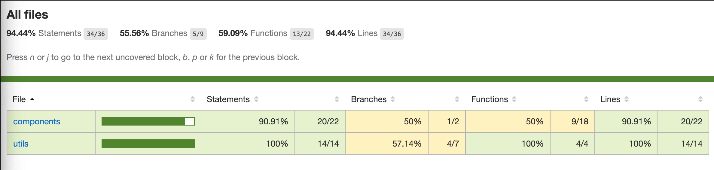

# Global 66 - Prueba técnica

> Desarrollado por Jersson Morales | [LinkedIn](https://www.linkedin.com/in/jersson-stiven-morales-alza-022115183/)

### [URL demo](https://pokedex-olive-mu.vercel.app/)

#### Capturas de pantalla

#### Tecnologias usadas

- **Vue**
- **Jest & Vue utils** (Pruebas unitarias).

#### Librerias adicionales

- **Prettier - eslint + plugins** (Validación de errores y formateo de archivos).
- **Husky - lint-stagged** (Validaciones de pruebas unitarias y linters previo a los commits).

#### Estructura  del proyecto

    frontend/
    |-- src/
    |   |
    |   |-- components/ # Componentes generales
    |   |-- config/     # Archivos de configuración y constantes
    |   |-- styles/     # Estilos generales y temas
    |   |-- views/      # Paginas
    |   |-- utils/      # Utilidades generales
    |   |
    |-- test/   # Pruebas unitarias
    |-- ../     # Archivos de configuración
    |-----

#### Scripts

-  **yarn serve** : Ejecuta el proyecto en modo desarollo.
-  **yarn build** : Compila el proyecto para enviarlo a producción
-  **yarn lint** : Corre el linter en el proyecto.
-  **yarn test:unit** : Ejecuta las pruebas unitarias.
-  **yarn test-with-coverage** : Ejecuta las pruebas unitarias y genera un reporte del cubrimiento
    de las pruebas.

#### Coverage

